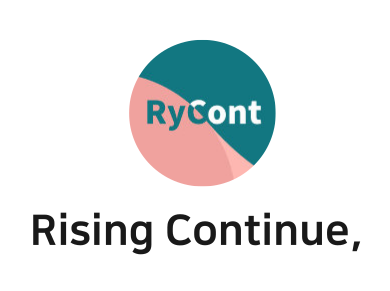

    

> I love what i do, i do what i love

[한국어로 보고싶으신가요?](https://github.com/rycont/rycont/blob/main/README.md)

## I am...
- Korea Digital Media High School Web Programming Department 19th Student
- Android Deveoping Startup ["#IMPLUDE"](http://implude.com/)
- Idea experimentation circle ["INU"](http://github.com/inudevs)
- School Intranet Frontend Developer ["DIMIGOIN"](https://github.com/dimigoin)

## Interests
### Frontend Analysis
Most Interested in!
- [benedu-nodejs](https://github.com/rycont/benedu-nodejs)
- [nodejs-selfcheck-automation-v2](https://github.com/rycont/nodejs-selfcheck-automation-v2)

### Hangeul, Korean
I like to analysis and utilize it
- [josa-complete](https://github.com/rycont/josa-complete)
- [listen-counter](https://github.com/rycont/listen-counter)
- [umjunsik-lang](https://github.com/rycont/umjunsik-lang)
- [Gnex](https://github.com/rycont/Gnex)

### Extend Existing Service
I wanna make you feel a experience that cannot be felt with existing service
- [google-assistant-tmap](https://github.com/rycont/google-assistant-tmap)
- [namu-reader](https://github.com/rycont/namu-reader)
- [codegen-ace](https://github.com/DIMI19WP/codegen-ace)
- [flowchat](https://github.com/flowchat-dev)
- [Benepanda](https://github.com/DIMI19WP/benepanda)
- [selfcheck-front](https://github.com/rycont/selfcheck-front)
    

[About more?😊](https://rycont.github.io/)